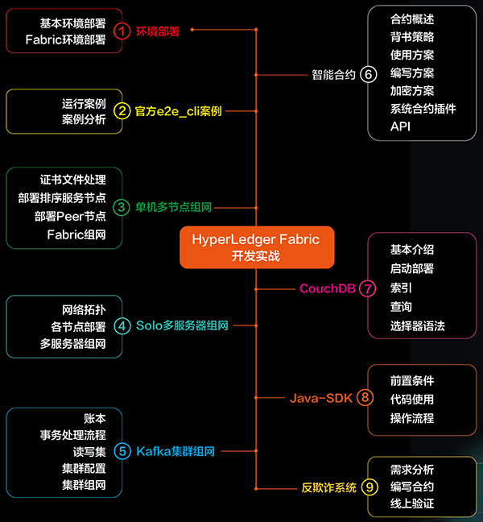

# 区块链模块
## 区块链相关脑图
[总体知识图谱](https://www.processon.com/view/5a911cf2e4b064e9ddcaa9ed#map)
### Fabric

## 学习资料
* [区块链github学习仓库](https://github.com/itheima1/BlockChain.git)
* 以太坊;资源链接:[https://pan.baidu.com/s/1WEUYRSAUbyns8-DlmauJ-w](https://pan.baidu.com/s/1WEUYRSAUbyns8-DlmauJ-w),提取码:iupk
* HyperledgerFabric实战联盟链;资源链接:[https://pan.baidu.com/s/1ZhJqbWp7fG-feDlrDIC5oA](https://pan.baidu.com/s/1ZhJqbWp7fG-feDlrDIC5oA),提取码:yhqa
* 区块链框架Hyperledger项目案例(华为平台);资源链接:[https://pan.baidu.com/s/1jC0iAB9IBAq3fueWFH90pw](https://pan.baidu.com/s/1jC0iAB9IBAq3fueWFH90pw),提取码:hf9m
* 区块链干货;资源链接:[https://pan.baidu.com/s/1bu_bDFP_JN5mDhcU7q8wEA](https://pan.baidu.com/s/1bu_bDFP_JN5mDhcU7q8wEA),提取码:ixb7
